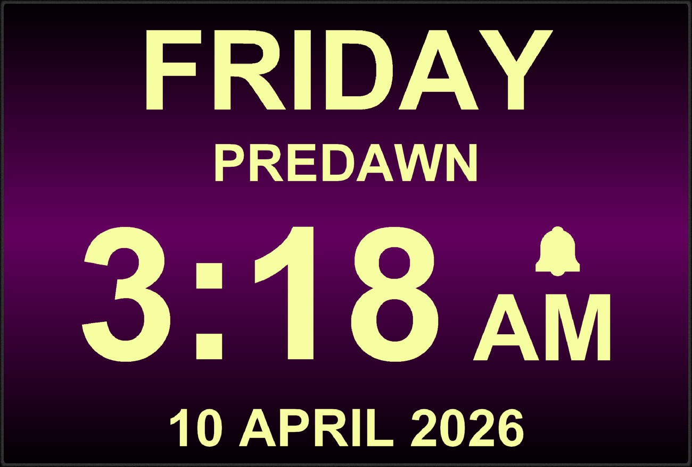
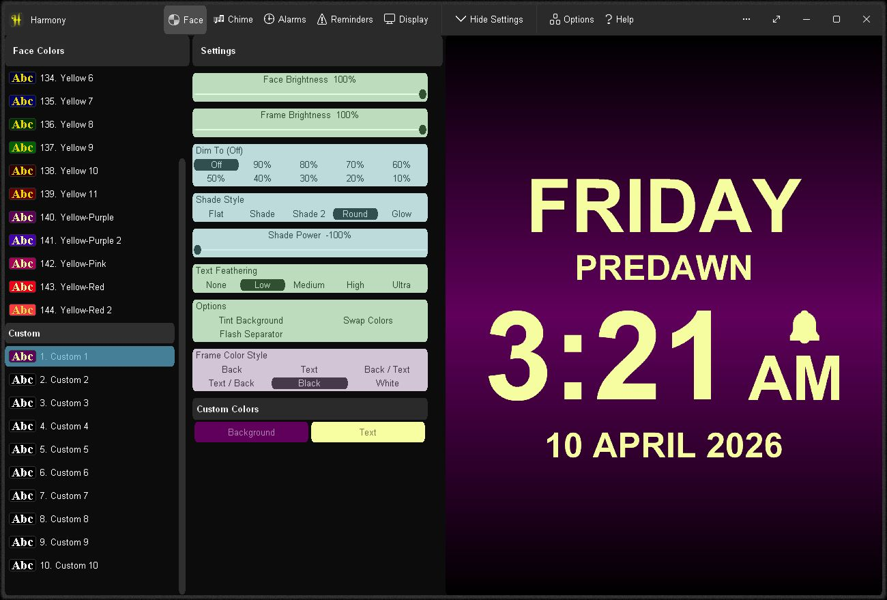
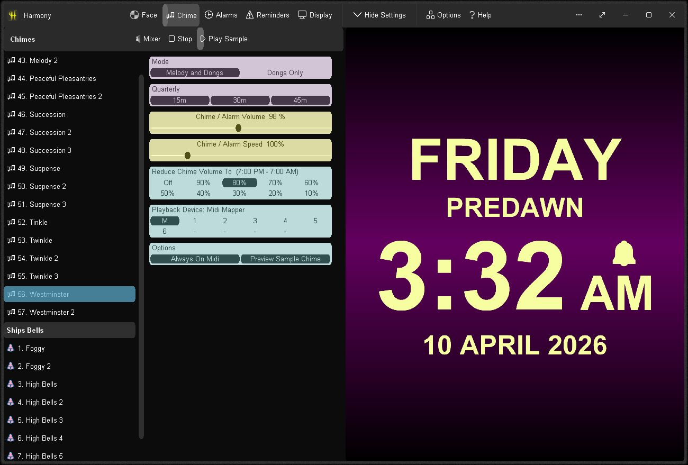
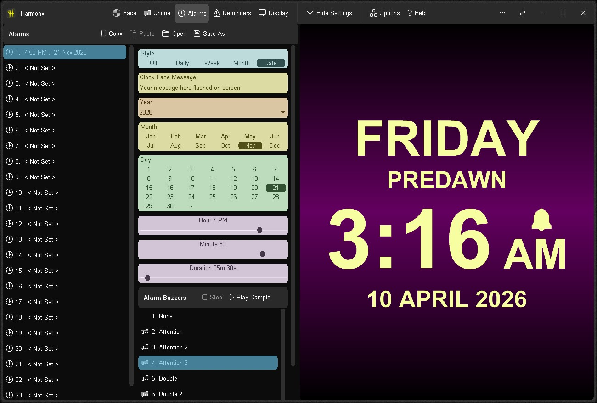
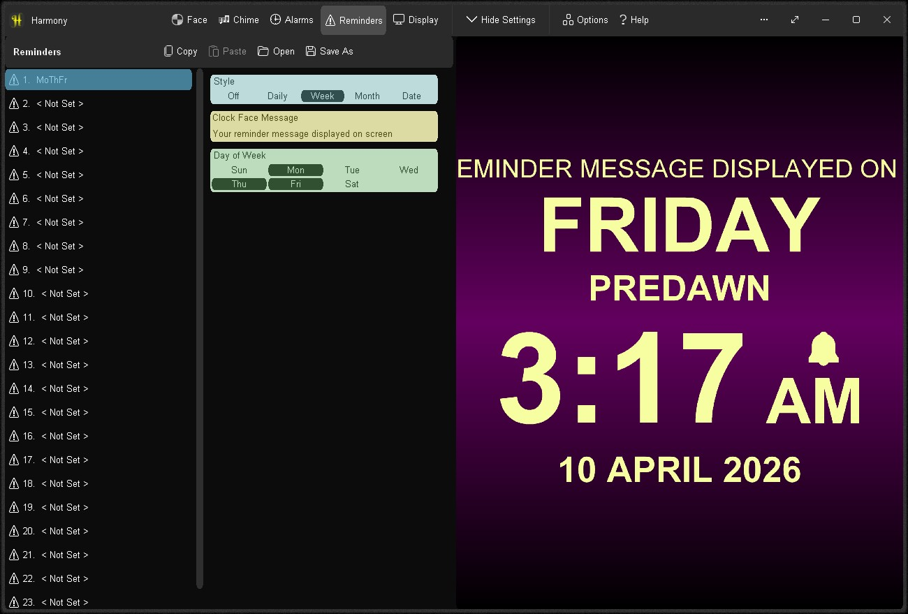
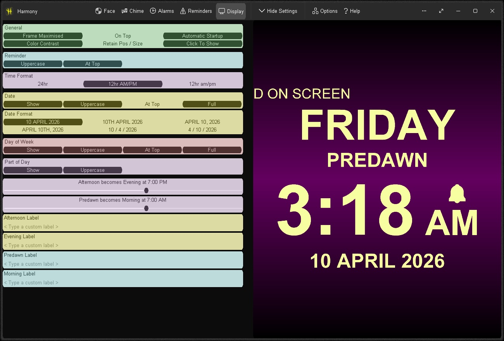
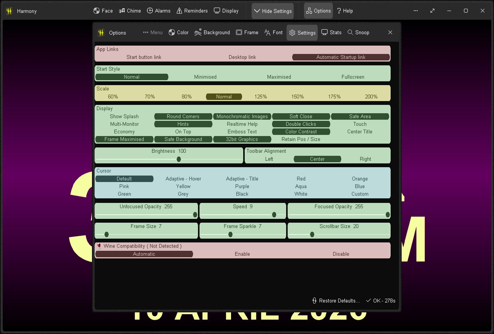
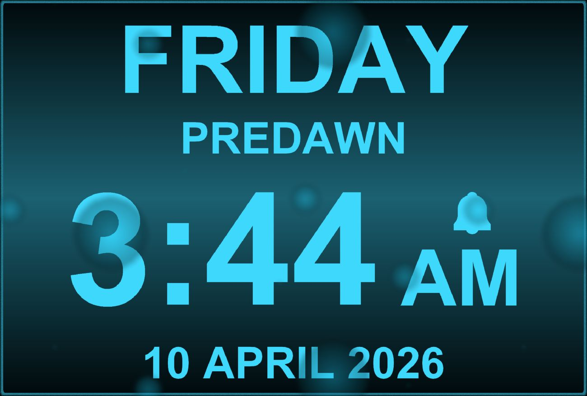

# Harmony
Digital display chiming clock with 100+ chimes and 50 alarms + reminders. Multiple chime styles of Melody, Ships Bells, British Royal Ships Bells, Grande Sonnerie and Petite Sonnerie. On-screen date / time / part of day. Custom coloring, time/date format and many options.

# Features
* Integrated toolbar with auto-hide for easy access to clock settings, alarms and reminders
* Click or tap the clock face, or press any key to silence an active alarm(s)
* Press the "ESC" key to toggle full screen mode
* Click and drag to position clock face
* Run clock windowed, maximised or in full screen mode
* 140+ built-in face color-pairs and 10 custom color-pair slots to customise the clock's text and background
* Adjust Face Brightness: 10-100%
* Adjust Frame Brightness: 10-100%
* Dim To (90-10%) - reduce brightness of clock during evening hours (7 PM - 7 AM by default)
* Face Shade Styles: Flat, Shade, Shade 2, Round and Glow
* Face Shade Power: -100% (shade to black) to +100% (shade to color)
* Text Feathering: None, Low, Medium, High and Ultra
* Face Options: Tint Background, Swap Colors and Flash Separator ":"
* 6 Frame Color Styles: Back, Text, Back+Text, Text+Back, Black and White 
* 56 Melody Chimes with intro and dongs
* 30 Ships Bells - standard and British Royal chimes
* 16 Sonnerie - Grande and Petite chimes
* Quarterly Chiming Options: 15m, 30m and 45m
* Chime Volume: 0-200%
* Chime Speed: 25-400% - 100% is default
* Reduce Chime Volume (90-10%) - quieten chimes during evening hours (7 PM - 7 AM by default)
* Definable Midi Playback Device: Choose between Midi Mapper and up to 10 installed midi devices (hardware and software)
* Chime Options: Always On Midi + Preview Sample Chime
* Set Alarms / Reminders by: Daily, Day of Week, Month or Date
* 50 Reminders with static message display (long messages are scrolled)
* 50 Flashing Alarm messages (long messages are scrolled) and optional alarm buzzer with gradual fade-in
* 60+ Built-in alarm buzzers to choose from
* Adjustable Alarm Duration: 10 seconds to 2 hours (10 sec intervals)
* Copy and Paste alarms and reminders to and from Clipboard
* Save All and Open all alarms and reminders to and from file
* General Options: Frame Maximised, On Top, Automatic Startup, Color Contrast (for settings), Retain Pos / Size (app position and size) and Click To Show (click clock face to show main toolbar)
* 3 Time Formats: 24hr, 12hr AM/PM or 12hr am/pm
* 6 Date Formats: 9 April 2026; 9th April 2026; April 9, 2026; April 9th, 2026; 9 / 4 / 2026; and 9 / 4 / 2026 
* Date Options: Show, Uppercase, At Top and Full (non-abbreviated)
* Day of Week Options: Show, Uppercase, At Top and Full (non-abbreviated)
* Part of Day Options: Show and Uppercase
* Customisable Part of Day Labels: Afternoon, Evening, Predawn and Morning
* Definable Evening Range: 1-11 PM (7 PM by default)
* Definable Morning Range: 1-11 AM (7 AM by default)
* Reminder Options: Uppercase and At Top
* Multi-monitor support
* Straightforward, fuss-free operation
* Options Window - Easily change app color, font and settings
* Portable
* Smart Source Code (Borland Delphi 3 and Lazarus 2.2/4.4)

# Download
<a href="src/harmony.exe">harmony.exe</a> - windows all

# Images

