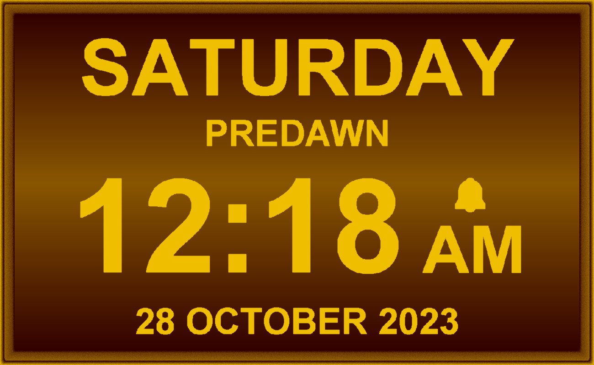
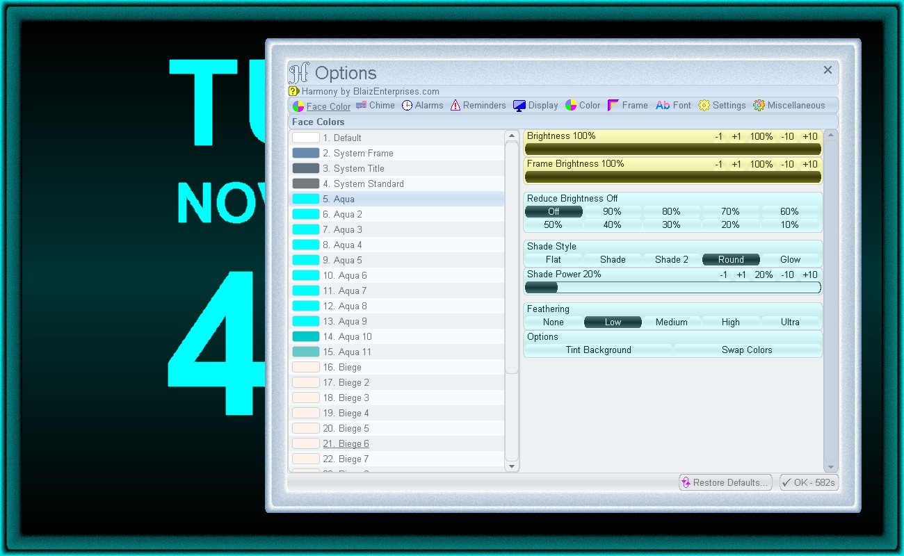
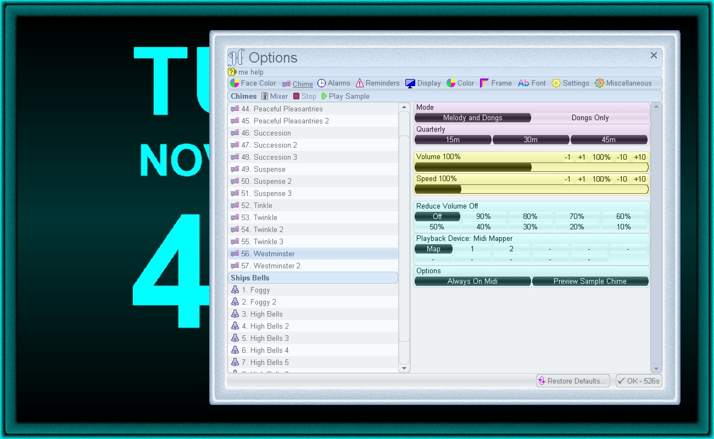
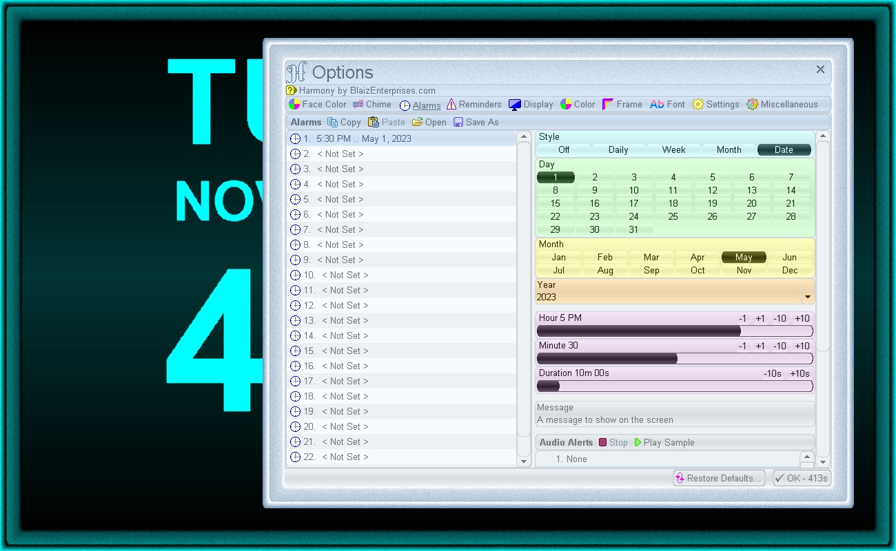
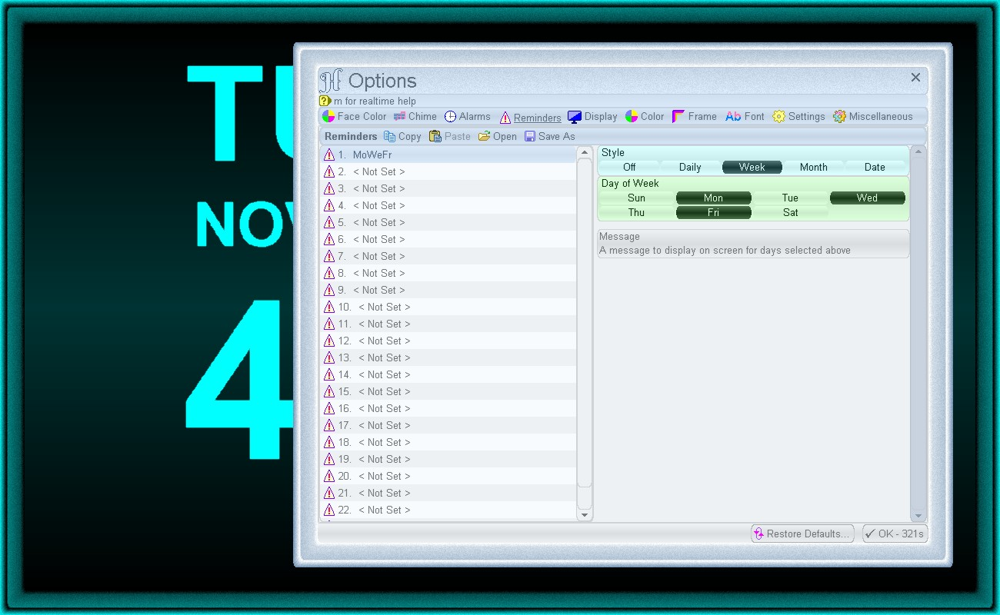
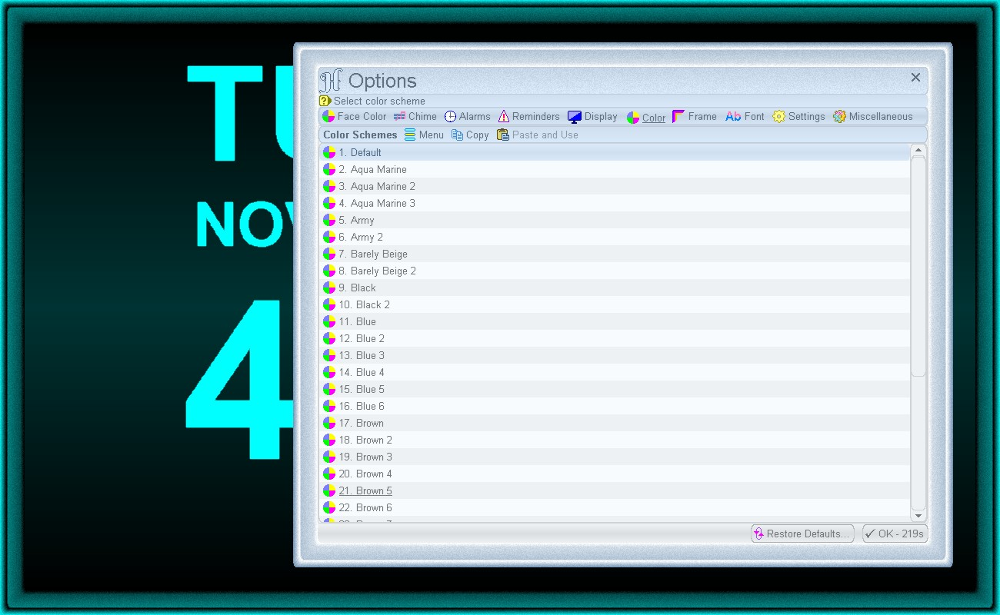
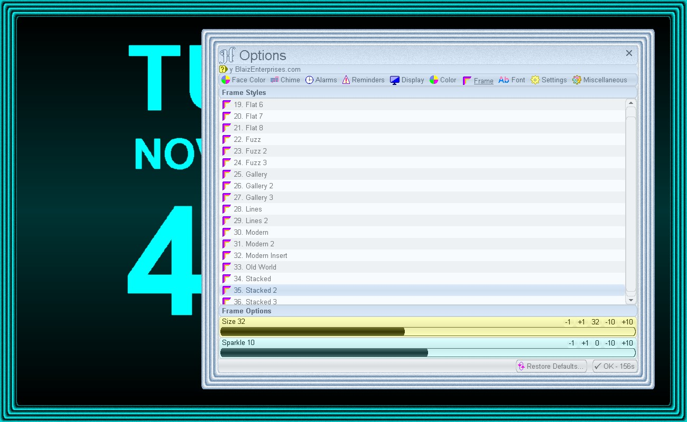

# Harmony
Digital display chiming clock with 100+ chimes and 50 alarms + reminders. Multiple chime styles of Melody, Ships Bells, British Royal Ships Bells, Grande Sonnerie and Petite Sonnerie. On-screen date / time / part of day. Custom coloring, time/date format and many options. Right click clock face for menu and select "Options" to customise.

# Features
* 135+ built-in face colors + 10 custom - set clock text / background color
* Brightness 10-100%
* Frame Brightness 10-100%
* Reduce Brightness during evening hours (7 PM - 7 AM default)
* Background Shade Styles: Flat, Shade, Shade 2, Round and Glow
* Background Shade Power: 10-100%
* Feathering: None, Low, Medium, High and Ultra
* Color Options: Tint Background and Swap Colors
* 56 Melody chimes
* 30 Ships Bells (Standard + British Royal) chimes
* 16 Sonnerie (Grande + Petite) chimes
* Quarterly chiming: 15m, 30m and 45m
* Chime volume 0-200%
* Chime speed 25-400% 
* Reduce Volume during evening hours (7 PM - 7 AM default)
* Definable Playback Device
* Chime Options: Always On Midi + Preview Sample Chime
* 50 reminders - on-screen scrolling message 
* 50 alarms - flashing on-screen scrolling message + audio alert
* 60+ Audio Alerts
* Alarm Duration: 10 seconds to 2 hours in 10 second intervals
* Set alarms and reminders by: daily, day of week, month or date
* Copy, Paste, Save and Open alarms and reminders to/from file and Clipboard
* General Options: Frame Maximised, Start Maximised and On Top
* Time Format: 24hr, 12hr AM/PM or 12hr am/pm
* Date Options: Show, Uppercase, At Top and Full
* 4 Date Formats
* Day of Week Options: Show, Uppercase, At Top and Full
* Part of Day Options: Show and Uppercase
* Reminder Options: Uppercase and At Top
* Definable Evening range of 1-11 PM (7 PM default)
* Definable Morning range of 1-11 AM (7 AM default)
* Customisable Part of Day labels: Afternoon, Evening, Predawn and Morning
* Simple and easy to use
* Lightweight and customisable graphical user interface (180+ color schemes, framed, font, zoom, cursor and many more options)
* Portable - No installation/alteration to your operating system
* Built-in Help - View detailed information directly in program
* No Internet Required - Run completely offline
* Free To Use - 100% freeware, no cost, no membership, no nags, no strings attached

# Download
<a href="src/harmony.exe">harmony.exe</a> - windows all

# Images

